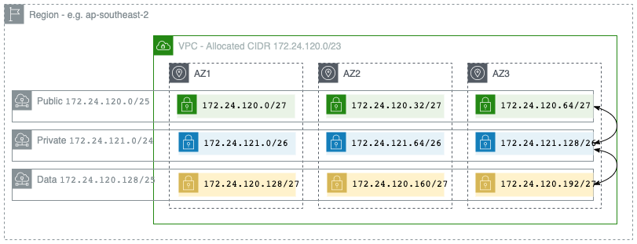

This repo contains the Iac for `myob-digitalex-lab (754474565068)` 
Authenticated as: `adfs-digitalex-lab-admin`

# Bootstrap Template

This repository contains the template bootstrap code that can be used by the Snowball Team to bootstrap a set of new accounts.

## Using this Repo

This repo has been set-up and configured as a `Template` repo. This means you can make a fork of this repo, update the parameter files as per instructions bellow, integrate with Buildkite (leveraging MYOB tools) and then bootstrap your accounts. All the required templates, including Buildkite pipeline deffinition files are included.

### Pre-Requisites:

* Have requested a new set of accounts from DNP (Do Not Panic) team. To do this post a request into `tr-platform-enable` tagging your manager for approval. You should ensure the name of the service that is being migrated is included in the name.
* Git
* A code editor (VS Code, Sublime etc).
* [pipe](https://github.com/MYOB-Technology/pipe). 

### Build Guide

1) From this repo click on the green `Use this template` button in the top right. Provide the repo a name using the following naming convention `[Project] Bootstrap` where `Project` is the name of the project/service that will be hosted in these accounts. Ensure the repo is set to `Internal` and `Include all branches` is **unchecked**. Click the green **Create repository from template** button at the bottom of the page and your repo will be created.

2) Perform a `git clone` on your newly created repo and clone a copy to your local machine.

3) Once cloned to your local machine create a new branch and update the following parameters:


* `dns/template.yml` - `HostedZoneName`: Substitute `[project]` in `[project].myob` with the name of the service/project you are deploying. I.e if it is `bankfeeds` the parameter would be `bankfeeds.myob`.

* `network/parameters/ap-southeast-2/dev|prod.yml`: Provide the VPC Network Details for both Dev & Prod environments. You will need to subnet down the VPC Cidr into public, private & data CIDR as per the requirements of your application/service. `PublicSubnetCidrs,PrivateSubnetCidrs & DataSubnetCidrs` are a list where each CIDR Range is the subnet of one AZ..

An example of this is bellow:

```yaml
---
AzCount: "3"
RegionCidr: 172.24.0.0/16
VpcCidr: 172.24.120.0/23
PublicNetworkCidr: 172.24.120.0/25
PrivateNetworkCidr: 172.24.121.0/24
DataNetworkCidr: 172.24.120.128/25
PublicSubnetCidrs: 172.24.120.0/27,172.24.120.32/27,172.24.120.64/27
PrivateSubnetCidrs: 172.24.121.0/26,172.24.121.64/26,172.24.121.128/26
DataSubnetCidrs: 172.24.120.128/27,172.24.120.160/27,172.24.120.192/27
```

* `peering/parameters/ap-southeast-2/dev|prod.yml`: For `PeerVpcId` enter the VPC ID of the VPC provisoned by the Do Not Panic team and the RouteTableId. For `PeerRouteId` provide the route table of the public subnet ID of the VPC. These details can be found in the Console of the AWS Accounts provisoned by the DNP (Do Not Panic Team).

An example of this is bellow:

```yaml
---
PeerVpcId: vpc-07019f8389d454517
PeerVpcCidr: 10.92.0.0/16
PeerRouteId: rtb-0d21fb2417a4ec6a2
```

* `ssm/template.yml` - `BucketPrefix`: Substitute `[project]` in `myob-[project]` with the name of the service/project you are deploying. I.e if the service was `bankfeeds` the parameter would equal `myob-bankfeeds`.


* `.buildkite/pipeline.yml` Update the `queue` with the name of the buildkite slug for the respective environment. The buildkite slug will be provided to you by the Do Not Panic team but it typically follows the following naming convention `[project]-[environment]` where if the service was Bankfeeds and environment was Dev the slug would be `bankfeeds-dev`. Please ensure you validate your slug with DNP.

* Remove everything from ------- (Line 93) up in the README.MD and subsititue each entry of `[Project]` in the README.MD with the name of the project/service that will be deployed.

4) Save your work and push your branch git, open up a PR, provide comments on your change and have your code merged into master.

### Deploy BK Agent Policy

Prior to deploying this stack via Buildkite, you will need to deploy the `iam/pipeine` stack manually from your machine and update the BK Agent parameter so that the managed policy can be attached to the BK Agent role.

You will need to have set your AWS programatic credentials via `myob-auth`. The bellow process will need to be completed for both `dev` & `prod` accounts.

1. From the root directory issue the following command:

```bash
make pipeline-policy -e ENVIRONMENT=<dev|prod>
```

This will deploy the `iam/pipeline` stack to the environment.

2. Once complete, navigate to `Cloudformation` in the AWS console and find the `<environment>-iam-pipeline` stack and note down the `PipelineRoleManagedPolicy` key value from the stack.

3. Navigate to Parameter Store from the AWS Console (Hint: It is under Systems Manager) and edit the `/bk/QUEUE/ManagedPolicyARN` parameter where `QUEUE` is the name of your BK Queue.

4. Under the `Value` field enter the `ARN` from the output of the CF Template in Step 2.

5. Navigate to Code Build from the AWS Console and you will notice one build project. Highlight the build and click Start Build, in the new window click the orange Start Build button and wait for the job to complete. This will attach the Policy to the BK Agent Role.

### Integrate GitHub with Buildkite & Execute Build

Configuration of CICD in MYOB is handeled by Pipe. This cli tool essentially integrates your github repo and buildkite repo together.

1. Install pipe and follow the steps in pipe's [README](https://github.com/MYOB-Technology/pipe) to configure.

2. Configure Buildkite using pipe with the following command:

``` bash
 pipe mk -p buildkite.yml <teamslug> <reposlug> queue=<queue> <pipeslug>
```

* the 'repo slug' is the slug for the github repo - the slug for this repo is 'pipe' for example.
* 'target' is a targeting string used in the pipeline yaml to selec a pool of agents. this is probably: queue=QUEUESLUG
* a 'pipeslug' is the name you want to give to the pipeline - probably this is the same as the repo, but not always.

By default you will now be able to deploy into your `dev` environment however you will need to ask gandalf for permissions before you can deploy to prod. Using the `myob-auth` tool, set your credentials to the `prod-admin` account and run the following command:

To do this, use the following command:

``` bash
pipe gandalf allow `repo slug`
```

3) Login to the buildkite console, click on pipelines in the top right and search for your pipeline using `pipeslug`. Open the pipeline and click **New Build** in the top right & then the green **Create Build** button.

-------

# [Project] Bootstrap

You can use the bellow information as a Readme for your newly created repo. Please ensure you update the `[project]` name in the DNS & AntiVirus sections.

## Architecture
### VPC
The VPC follows a standard 3 layer structure with a 2x larger private subnet tier and 1x smaller public subnet. The subnets have been over-provisioned to allow for fall-back into a single Availability Zone if required, as well as to align to a binary pattern required for proper CIDR mappings.

Please note, the CIDR Range in the bellow diagram are just an example.



### Stack Layers

The foundations stacks are separated into the following layers:

* `network`: VPC, Subnets, VPC Flow Logs
* `routing`: Internet Gateway, NAT Gateways, Route Tables, VPC Endpoints
* `nacls`: Network ACLs
* `vpn`: Virtual Private Gateway, Customer Gateways, VPN Connections
* `securitygroups`: Base and AWS-centric Security Groups
* `securitygroups-subscriptions`: Security Groups Automation for AWS IP ranges
* `dns`: Route53 Internal Hosted Zone
* `antivirus`: Deploys 2 SSM Documents and associations, one to update ClamAV DB every 60 minutes, one to execute Clamscan every morning @ 2:00am.
* `peering`: Peers the VPC provisoned by DNP with the VPC deployed in this repo to enable BK agent to bake AMIs using the private address space.
* `storage`: Creates an S3 Artefact Bucket and bucket policy.
* `iam/packer`: Creates an IAM role that can be used by Packer to provide access to the S3 Artefacts bucket.
* `iam/pipeline`: Creates an IAM managed policy that can be attached to the BK Agent enabling buildkite to have greater control over the environment.
* `kms`: Adds a KMS key that can be used for Shush to encrypt/decrypt secrets

### Network, Subnets, & NACLs

Best practice on AWS defines that there should be a DMZ zone that works as a gateway to the rest of the environment, this zone should not have access to data back-end, the 3 layered approach to this is to set up routing and access rules to allow the `public` subnet to access the `private` subnet, but not the `data` subnet. Only resources inside the `private` subnet should be able to access the `data` subnet as a general rule. Monitoring tools, jump hosts, and AWS services that require access may have to be exempted from this rule.

The Network stack provisions a VPC, subnets within that VPC, DHCP Options for the VPC, and VPC Flow Logs to a CloudWatch log group. The number of Availability Zones that are deployed is configurable through a stack parameter; this parameter is then exported for consumption by other stacks, along with the VpcId, VpcCidr, Subnet Id's, and Subnet Cidr's.

### Routing

Routing for the VPC is provisioned within the routing stack. Route tables for the Public, Private and Data Subnets are created; The Public subnets are configured with a default route to an Internet Gateway, with the Private and Data subnets having their default routes through AZ specific NAT Gateways. The NAT Gateways have static EIPs provisioned, which allows these addresses to be white-listed by 3rd parties.

VPC Endpoints are provisioned for S3 and DynamoDB, and these endpoints are added to the relevant route tables; the S3 endpoint is available to all subnets, the DynamoDB endpoint is available to Private and Data subnets.

The EIPs of the NAT Gateways, and references to the routing tables are exported from this stack for consumption by the peering stack.

### Security Groups

A number of platform level security groups are provisioned:

* `[ENVIRONMENT]-aws-s3-sg`: Allows access to S3 over HTTP and HTTPS
* `[ENVIRONMENT]-aws-apis-sg`: Allows access to the AWS APIs (in ap-southeast-2 & global) over HTTPS
* `[ENVIRONMENT]-aws-cloudfront-sg`: Allows inbound access from CloudFront on TCP/443
* `[ENVIRONMENT]-aws-route53-healthchecks-80-sg`: Allows inbound access from Route53 Health Checks on TCP/80
* `[ENVIRONMENT]-aws-route53-healthchecks-443-sg`: Allows inbound access from Route53 Health Checks on TCP/443

The AWS specific security groups are automatically kept up to date using an SNS subscription to the AWS ip list, and lambda functions that update the groups; see https://docs.aws.amazon.com/general/latest/gr/aws-ip-ranges.html for more information.

### DNS

A private Hosted Zone is provisioned within each environment; this takes the form of `[ENVIRONMENT].[project].myob` where project is the name of the service you are using these accounts for.

Stack outputs support the import of the Zone Name and Zone Id in other stacks; these allow records to be created within the zone by component cloudformation stacks.

### SSM

Systems manager has been set-up and configured and will collect inventory on all the instances for the respective account every 8 hours.

A maintenance window has been configured to scan for security patch-updates every night from 9:00pm for 2 hours with the output of these logs avaliable in SSM itself. Instances with the tag `Key=patch-scan, Value='y'` will be targeted.

An SSM Document is created that will triggers the SSM agent to be updated on every EC2 in the account, this triggers at 8:00pm every night.

Session Manager has been set-up to enable system level access to each instance and to avoid having to set-up a bastion and using it as a jump post between machines.

This template will also deploy a new instance profile/role and managaged policy that will need to be attached to every instance to allow SSM the required access to manage the instance and also enables Cloudwatch logging & metrics (should this instance profile be attached). The policy is provided as an output so it can be attached to any newly created roles/instance profiles. The is outputed as `${AWS::StackName}::SSMManagedPolicy`

### Anti Virus

Anti-Virus creates 2x SSM documents to handle both the updating of ClamAV DB and also to execute the clamscan command. Both are built on `AWS-RunShellScript` SSM Document and have a State Association that execute the scripts based on a cron/rate. The Freshclam update executes every 60 minutes ensuring the ClamAV Virus deffinitions are up to date and a clamscan virus scan will execute at 2:00am every morning on every instance in the account.

### Peering

When a set of accounts is provisioned by the DNP a VPC is created with a set of public subnets. These are used to host the buildkite agent. We have peered both VPCs together to ensure connectivity between the BK agent VPC and the VPC provisoned in this repo to allow the baking of AMIs accross the private address space. This ensures compliance with MYOB security standards. 

The templates will automate handle the peering of the VPCs and update the required route tables.

### AMI Clean

A Lambda has been written to clean up any AMIs older than 3 days. The Lambda will check to see if the AMI is in use before removing it. If the AMI is in use by an EC2 it will not be deregistered. The lambda is triggered by a cloud watch event at 11:00pm every night.

### Storage

An S3 bucket is created to hold artefacts that may be needed when an AMI is baked or otherwise. This could either be a specific dependency or an artefact produced by an application team. 

The naming convention for this bucket is `[bucket-prefix]-[AWS::AccountId]-artefacts-bucket`. Bucket prefix is a concatintion of `myob-[project]` where project is the name of the project/service being deployed. S3 Bucket Policy restricts access to the bucket to the Dev & Production Accounts.

### IAM/Packer

The IAM module will deploy a Role, Instance Profile and managed policy that can be used by packer to provide access to the S3 artefact bucket. This can be used by your packer builds to ensure that the instance building your AMI is able to interact with the S3 artefact bucket. The managed policy `systems-manager-access-policy"` is also attached to this policy to ensure session manager can be used in the event you spin up an insatnce to do testing and need to pull from the S3 artefacts bucket.

### IAM/Pipeline

This IAM module will deploy a managed policy that can be attached the BK agent role that will provide a greater level of controls to the environment. Nb: This role is deployed locally from your machine and is not managed via the CICD Pipeline itself. Please refer to instructions bellow to deploy.

## Deployment Steps (CICD)

As great as it is to deploy this locally, for testing or otherwise, ideally you will want to be deploying this through Buildkite! Well, the good news is we have done the heavy lifting and this has already been integrated with buildkite!

As per standard Git workflow you should pull code and create feature branches to introduce your changes. When a feature branch is pushed this will automatically trigger the pipeline and your changes will be deployed into Dev so you can test and validate. Once you are happy with your changes open up a PR and have your branch merged. This will allow you to deploy to Prod.

## Deployment Steps (Manual)

The following commands outline how to deploy these templates into an environment from your CLI.

### Toolimg
If you are running a Mac or Linux machine you will need the following tools installed:

* Docker
* Git

If you are running a windows machine you will need to install the WSL (Windows Subsystem Linux) and have the following installed:

* Docker Desktop
* Git (Install into WSL)

To set-up WSL on your windows machine please follow the instructions (here)[https://myobconfluence.atlassian.net/l/c/82A0qDeW]

### Set your AWS Credentials

Using (myob-auth)[https://github.com/MYOB-Technology/myob-auth] to authenticate with your AWS accounts, set your environment variables.

### Test & Deploy

Linting & CF Template Validation:

From the root of this repo, run the following command

``` bash
make test
```

Deploy this stack:

To deploy the stacks run the following commands:

``` bash
make ENVIRONMENT=dev AWS_DEFAULT_REGION=<your aws region> deploy 
```

Example:

``` bash
make ENVIRONMENT=dev AWS_DEFAULT_REGION=ap-southeast-2 deploy 
```

## Clean up Steps (Manual)

### Development AWS clean up steps

To clean up your environment, run the following command:

``` bash
make ENVIRONMENT=dev AWS_DEFAULT_REGION=<your aws region> clean 
```

Example:
``` bash
make ENVIRONMENT=dev AWS_DEFAULT_REGION=ap-southeast-2 clean 
```
